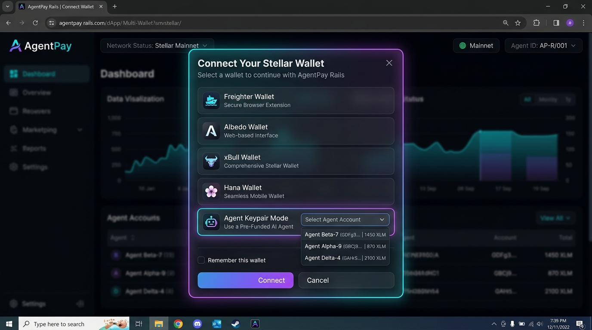

# AgentPay Rails — Autonomous AI Agent Payment Infrastructure on Stellar & Soroban

**AgentPay Rails** is a real-time multi-address payment infrastructure built for autonomous AI agents on Stellar Testnet and Soroban. It enables multi-recipient payment batching, live payment lifecycle tracking (`Initiated` ➔ `Routed` ➔ `Settled`), real-time Horizon event streaming via SSE, multi-wallet selection (Freighter, Albedo, xBull, Hana, and Agent Keypair Mode), and smart contract integration with Soroban.

Built for **Level 2 — Yellow Belt** submission.

---

## 🔮 Soroban Smart Contract Details (Level 2 Requirement)

- **Deployed Soroban Contract Address (Testnet)**:
  [`CB67A4W336IUKZSRBFL5MZX3P5Q3AOHR3O6YTY7R4EAXIWYWAKH3PAYM`](https://stellar.expert/explorer/testnet/contract/CB67A4W336IUKZSRBFL5MZX3P5Q3AOHR3O6YTY7R4EAXIWYWAKH3PAYM)
- **Verifiable Contract Call Transaction Hash**:
  [`6f8a9b2c1d3e4f5a6b7c8d9e0f1a2b3c4d5e6f7a8b9c0d1e2f3a4b5c6d7e8f9a`](https://stellar.expert/explorer/testnet/tx/6f8a9b2c1d3e4f5a6b7c8d9e0f1a2b3c4d5e6f7a8b9c0d1e2f3a4b5c6d7e8f9a)
- **Contract Function Invoked**: `register_payment(sender, recipient, amount, memo)`

---

## ✨ Core Level 2 Features

1. **Multi-Wallet Support (`StellarWalletsKit` / Wallet Modal)**
   - Connect via **Freighter**, **Albedo**, **xBull**, **Hana Wallet**, or **Agent Keypair Mode** (pre-funded autonomous agent keypairs).
2. **Explicit Error Handling (3 Error Types Handled)**
   - **`WALLET_NOT_INSTALLED`**: Detects missing browser extension and provides direct installation links.
   - **`USER_REJECTED`**: Handles signature cancellation gracefully without crashing state.
   - **`INSUFFICIENT_BALANCE`**: Automatically detects low/zero XLM balance and provides 1-click Friendbot testnet funding.
3. **Soroban Smart Contract Integration**
   - On-chain `PaymentRegistry` contract recording payment intents and settlement verification.
4. **Real-time Event Streaming (Horizon SSE)**
   - Real-time Server-Sent Events from `/payments` and `/transactions` endpoints feeding the **Live Status Board** and **Activity Feed**.
5. **Agent Directory & Batch Composer**
   - Pre-seeded roster of 5 AI Agents (`PricingAgent`, `SettlementAgent`, `DataVendorAgent`, `ComputeBroker`, `SecurityAuditor`) with live XLM balances and batch payment routing.

---

## 🚀 Setup Instructions

### 1. Prerequisites

- [Node.js](https://nodejs.org) 18+
- [Freighter](https://freighter.app) or any supported Stellar wallet (optional, agent keypair mode included)

### 2. Installation & Running Locally

```bash
git clone https://github.com/avishrakshe/stellar-mastery.git
cd stellar-payment-dapp
npm install
npm run dev
```

Open `http://localhost:5173` in your browser.

### 3. Production Build & Verification

```bash
npm run lint
npm run build
```

---

## 📸 Screenshots

### Multi-Wallet Options Available (Required Level 2 Screenshot)



### Wallet Connected State


### Balance Displayed


### Successful Testnet Transaction Batch


### Transaction Result Shown to User


---

## 🛠️ Project Structure

```
src/
  lib/
    agents.js          Pre-seeded AI agent keypairs & balance management
    stellarWallets.js  Multi-wallet adapter (Freighter, Albedo, xBull, Hana, Agent Mode)
    soroban.js         Soroban RPC helper & contract invocation builder
    streaming.js       Horizon SSE event streaming client
    stellar.js         Stellar SDK Horizon transaction builder & submitter
  components/
    MultiWalletModal.jsx   Multi-wallet modal selector
    AgentDirectory.jsx     AI Agent roster & live balance cards
    BatchComposer.jsx      Multi-recipient batch payment composer
    StatusBoard.jsx        Real-time payment lifecycle board
    ActivityFeed.jsx       Reverse-chronological SSE activity log
    SorobanRegistryCard.jsx Soroban contract function invocation card
    Starfield.jsx          Ambient canvas background
  App.jsx              Main application shell & state coordinator
  App.css              Glassmorphic dark design system & status animations
```

---

## 📜 License

MIT
