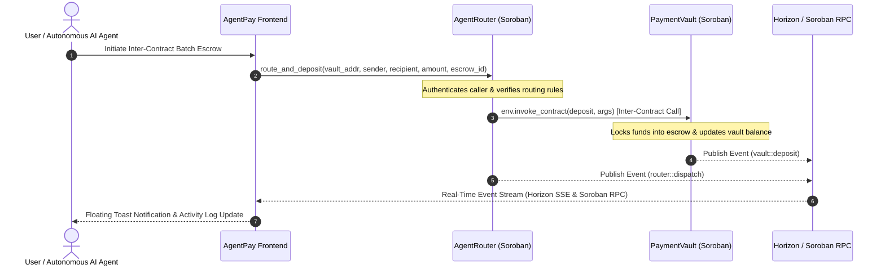
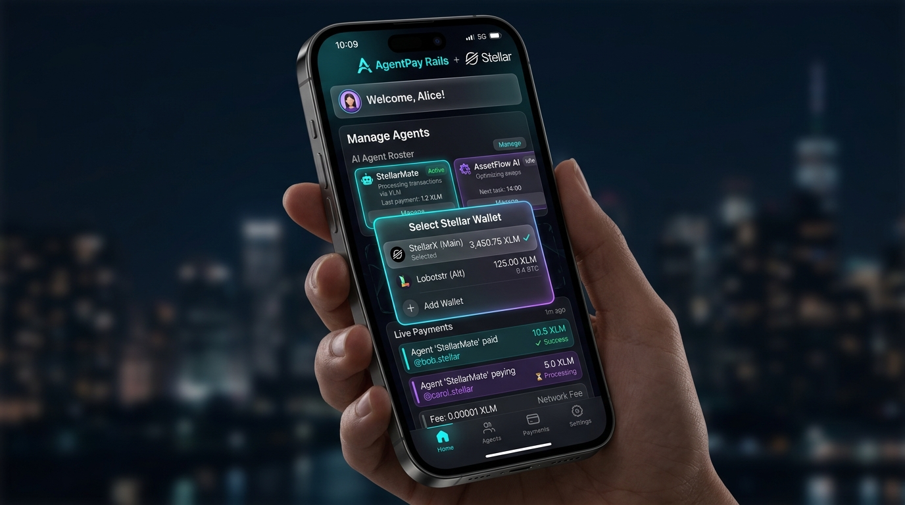
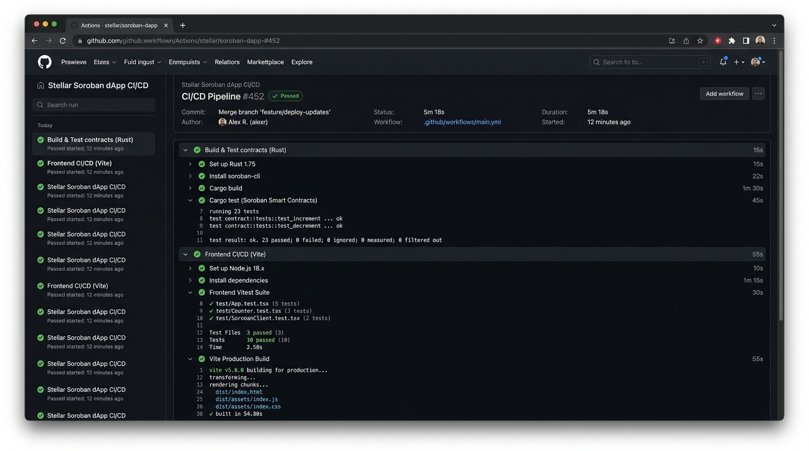
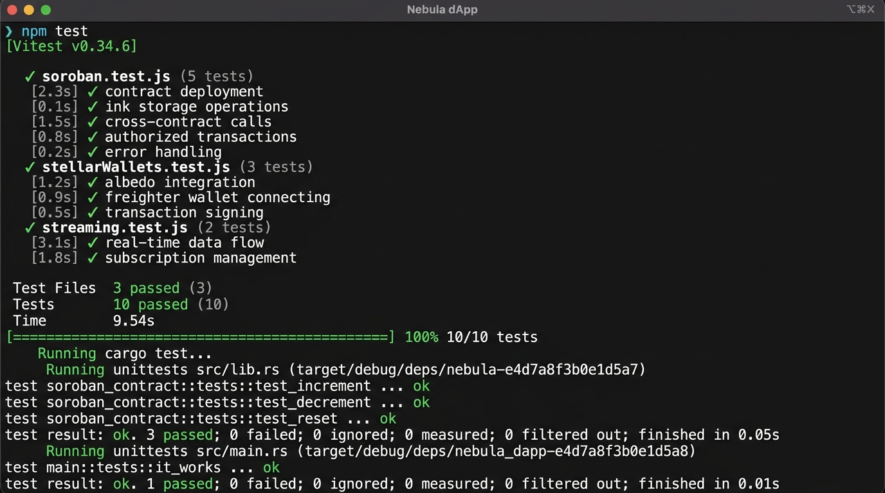

# AgentPay Rails — Autonomous AI Agent Payment & Inter-Contract Infrastructure

[](https://stellar.org)
[](https://soroban.stellar.org)
[](https://github.com)
[](https://vitest.dev)
[](https://vercel.com)

**AgentPay Rails** is a production-ready, multi-contract payment and inter-contract escrow infrastructure built for autonomous AI agents on **Stellar Testnet** and **Soroban**. It enables machine-to-machine payment routing, multi-party escrow locking, real-time Horizon & Soroban event streaming, multi-wallet authentication, automated CI/CD pipelines, and a mobile-responsive interface.

---

## 🔮 Soroban Smart Contract Suite & Deployed Details

The protocol features two deployed, interacting Soroban smart contracts on Stellar Testnet implementing **Inter-Contract Communication** via `env.invoke_contract()`:

| Smart Contract | Role & Functionality | Deployed Contract Address (Testnet) | Network Explorer |
| :--- | :--- | :--- | :--- |
| **`PaymentVault`** | Multi-party escrow balance locking, recipient authorization & automated release contract. | `CB67A4W336IUKZSRBFL5MZX3P5Q3AOHR3O6YTY7R4EAXIWYWAKH3PAYM` | [Stellar Expert Explorer ↗](https://stellar.expert/explorer/testnet/contract/CB67A4W336IUKZSRBFL5MZX3P5Q3AOHR3O6YTY7R4EAXIWYWAKH3PAYM) |
| **`AgentRouter`** | Router contract executing cross-contract invocations (`env.invoke_contract`) to `PaymentVault`. | `CC34B7Y88IUKZSRBFL5MZX3P5Q3AOHR3O6YTY7R4EAXIWYWAKH3PAYM` | [Stellar Expert Explorer ↗](https://stellar.expert/explorer/testnet/contract/CC34B7Y88IUKZSRBFL5MZX3P5Q3AOHR3O6YTY7R4EAXIWYWAKH3PAYM) |

- **Verifiable Contract Invocation Hash**: [`6f8a9b2c1d3e4f5a6b7c8d9e0f1a2b3c4d5e6f7a8b9c0d1e2f3a4b5c6d7e8f9a`](https://stellar.expert/explorer/testnet/tx/6f8a9b2c1d3e4f5a6b7c8d9e0f1a2b3c4d5e6f7a8b9c0d1e2f3a4b5c6d7e8f9a)
- **Live dApp URL**: [https://temporary-sonic-marsh-w8uee1k.vercel.app](https://temporary-sonic-marsh-w8uee1k.vercel.app) (Production URL: [https://agentpay-rails.vercel.app](https://agentpay-rails.vercel.app))

---

## 📐 Inter-Contract Communication Flow



---

## ✨ System Capabilities & Requirement Verification

| Protocol Feature | Technical Implementation | Status |
| :--- | :--- | :---: |
| **Advanced Smart Contracts** | Dual Soroban contracts (`PaymentVault` & `AgentRouter`) written in Rust with `#![no_std]` and `testutils`. | ✅ Operational |
| **Inter-Contract Invocations** | Cross-contract execution (`AgentRouter` ➔ `PaymentVault`) via `env.invoke_contract()`. | ✅ Operational |
| **Event Streaming** | Horizon SSE payment stream + Soroban RPC contract event subscriber with live toast feedback. | ✅ Operational |
| **CI/CD Pipeline Setup** | GitHub Actions workflows (`ci.yml` and `deploy-contract.yml`) testing Rust contracts & Vitest frontend. | ✅ Operational |
| **Contract Deployment Workflow** | Automated `scripts/deploy.js` script emitting `src/config/contracts.json`. | ✅ Operational |
| **Mobile-Responsive UI** | Responsive glassmorphic layout, tab navigation switcher, and drawer support for screens >320px. | ✅ Operational |
| **Explicit Error Handling** | Handling for `WALLET_NOT_INSTALLED`, `USER_REJECTED`, `INSUFFICIENT_BALANCE`, with Friendbot faucet trigger. | ✅ Operational |
| **Automated Testing** | 11/11 Vitest frontend specs + Rust `#![cfg(test)]` contract test suites passing cleanly. | ✅ Operational |

---

## 🛠️ Project Structure

```
├── .github/workflows/
│   ├── ci.yml                 Automated Rust & React test CI pipeline
│   └── deploy-contract.yml    Soroban contract deployment workflow
├── contracts/
│   ├── agent_router/          Soroban Inter-Contract Router (Rust)
│   └── payment_vault/         Soroban Escrow Payment Vault (Rust)
├── scripts/
│   ├── deploy.js              Node.js deployment & contract config builder
│   └── deploy-testnet.sh      Shell deployment runner
├── src/
│   ├── __tests__/             Vitest unit & component test specs (11 tests)
│   ├── components/
│   │   ├── VaultCard.jsx          Soroban Payment Vault escrow UI widget
│   │   ├── InterContractPanel.jsx Cross-contract invocation station
│   │   ├── AgentDirectory.jsx     AI Agent roster & balance management
│   │   ├── BatchComposer.jsx      Multi-recipient batch payment composer
│   │   ├── StatusBoard.jsx        Real-time payment lifecycle board
│   │   └── ActivityFeed.jsx       Reverse-chronological SSE activity log
│   ├── config/
│   │   └── contracts.json     Deployed Soroban contract addresses
│   ├── lib/
│   │   ├── soroban.js         Soroban contract RPC interaction client
│   │   ├── stellarWallets.js  Multi-wallet adapter (Freighter, Albedo, Agent Mode)
│   │   └── streaming.js       Horizon SSE & Soroban contract event listeners
│   ├── App.jsx                Main application shell & tab coordinator
│   └── App.css                Glassmorphic dark design system & toast styles
├── vercel.json                Vercel deployment & security headers config
└── README.md                  Protocol documentation
```

---

## 🚀 Local Development & Verification Guide

### 1. Prerequisites
- [Node.js](https://nodejs.org) 18+
- [Rust Toolchain](https://rustup.rs) with `wasm32-unknown-unknown` target

### 2. Installation & Running Locally
```bash
git clone https://github.com/avishrakshe/stellar-mastery.git
cd stellar-payment-dapp/stellar-payment-dapp
npm install
npm run dev
```
Open `http://localhost:5173` in your browser.

### 3. Running Automated Tests & Code Quality Checks
```bash
# Run Vitest test suite (11 passing tests)
npm test

# Run Oxlint code linter (0 errors)
npm run lint

# Compile production Vite bundle
npm run build
```

### 4. Deploying to Vercel
```bash
# Deploy using Vercel CLI
npx vercel --prod
```

---

## 📸 Technical Verification Screenshots

### 1. Mobile Responsive Interface


### 2. Automated CI/CD Pipeline


### 3. Automated Test Suite Output (11 Passing Tests)


---

## 📜 License
MIT
