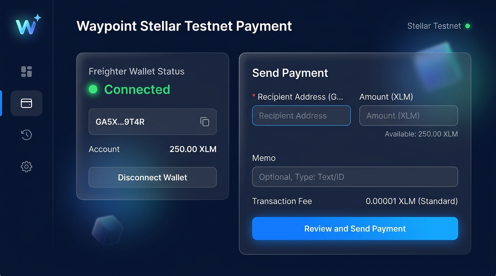
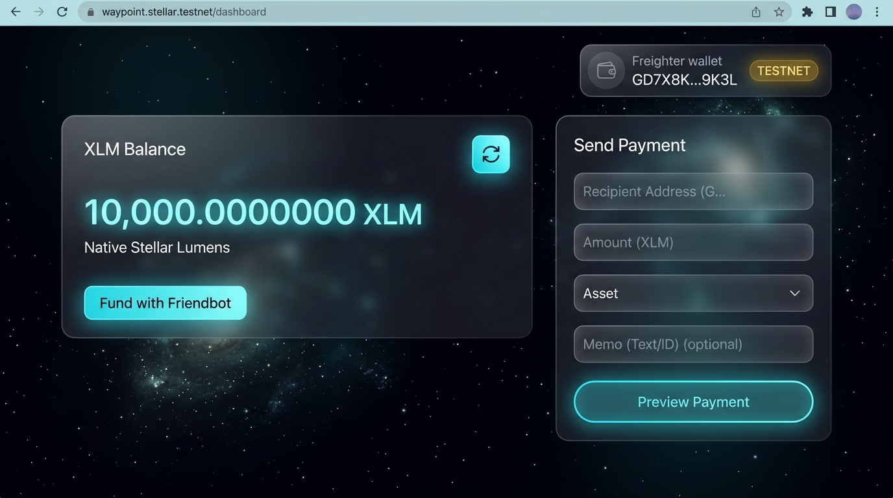
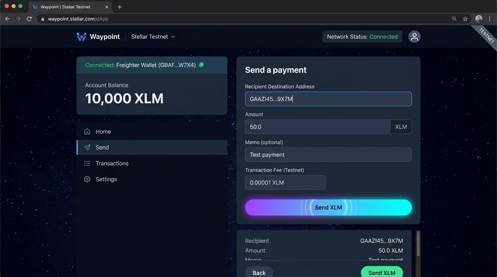
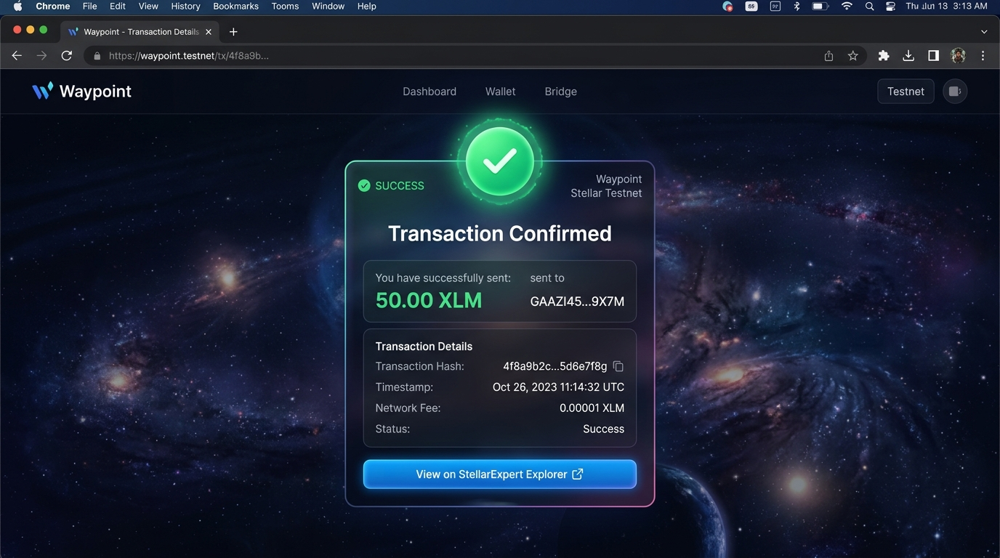

# Waypoint — Stellar Testnet Payment dApp

A minimal, polished dApp for sending XLM on the Stellar test network. Connect a
[Freighter](https://freighter.app) wallet, check your testnet balance (with a
one-click Friendbot fund for empty accounts), send a payment to any address,
and get clear success/failure feedback with a link to view the transaction on
[Stellar Expert](https://stellar.expert/explorer/testnet).

Built for the White Belt / Level 1 challenge: wallet connect, balance
handling, and a full send-payment transaction flow, all on Stellar Testnet.

## Features

- **Wallet connect / disconnect** via the Freighter browser extension, with a
  check that the wallet is actually set to Test Net before allowing a send
- **Balance handling** — fetches the connected account's native XLM balance
  from Horizon testnet; offers to fund brand-new (unfunded) accounts via
  Friendbot
- **Transaction flow** — builds a native XLM payment operation, has Freighter
  sign it client-side, submits it to Horizon, and reports success (with
  transaction hash + explorer link) or failure (with a readable error)
- Dark, glassmorphic UI with an ambient starfield background

## Tech stack

- [React](https://react.dev) + [Vite](https://vitejs.dev)
- [`@stellar/stellar-sdk`](https://www.npmjs.com/package/@stellar/stellar-sdk) — transaction building, Horizon queries
- [`@stellar/freighter-api`](https://www.npmjs.com/package/@stellar/freighter-api) — wallet connect + signing
- Plain CSS (no framework) — design tokens in `src/index.css`

## Setup instructions

### 1. Prerequisites

- [Node.js](https://nodejs.org) 18+
- The [Freighter](https://freighter.app) browser extension installed
- A Freighter account switched to **Test Net** (Freighter → Settings → change network to `TESTNET`)

### 2. Install and run

```bash
git clone <this-repo-url>
cd stellar-payment-dapp
npm install
npm run dev
```

Open the printed local URL (e.g. `http://localhost:5173`) in the same browser
where Freighter is installed.

### 3. Get testnet XLM

If your account has never been used on testnet, the app will detect it
doesn't exist yet and show a **Fund with Friendbot** button — click it to
receive 10,000 test XLM instantly. You can also fund manually at
[laboratory.stellar.org/#account-creator?network=test](https://laboratory.stellar.org/#account-creator?network=test).

### 4. Send a payment

1. Click **Connect Freighter** and approve the connection
2. Once your balance loads, fill in a destination `G...` address and an
   amount in the **Send a payment** panel
3. Click **Send XLM** and approve the signature request in the Freighter
   popup
4. Watch the result panel for the confirmation and transaction hash

### 5. Build for production

```bash
npm run build
npm run preview
```

## Project structure

```
src/
  lib/
    freighter.js       wallet connect/disconnect + signing wrapper
    stellar.js          Horizon balance fetch, Friendbot funding, tx build/submit
  components/
    Starfield.jsx        ambient canvas background
    WalletConnect.jsx    connect / disconnect UI
    BalanceCard.jsx      XLM balance + refresh + fund
    SendForm.jsx         destination / amount / memo form with validation
    TransactionResult.jsx  success / failure feedback + explorer link
  App.jsx                wires the flows together
  App.css                layout + component styling
  index.css               design tokens + global styles
```

## Screenshots

**Wallet connected**



**Balance displayed**



**Successful testnet transaction**



**Transaction result shown to the user**



## Notes

- This app only ever talks to Stellar **Testnet** Horizon
  (`https://horizon-testnet.stellar.org`) and Friendbot — no mainnet funds are
  ever at risk.
- Transaction signing happens entirely inside the Freighter extension; this
  app never sees or handles private keys.
